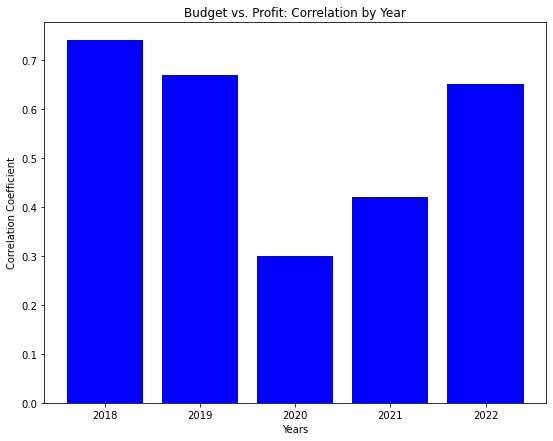

# American Movie Trends Before and After COVID: Analysis Report

## `Description`
An analysis of American movie trends before and after the COVD-19 pandemic based on data from [IMDb](https://www.imdb.com/) (**I**nternet **M**ovie **D**atabase).

## `Team Info`

- Acknowledgements:
    * Program: [University of California Berkeley Data Analytics Bootcamp](https://bootcamp.berkeley.edu/) (February - August 2023 cohort)
    * Instructor: Ahmad Sweed
    * TA's: Venkata Kuppa, Karen Fisher, Brian Perry, Ryan Bernstein
    * Tutor: Bethany Lindberg
- Analysis by 
    * [Crimson Amaro](https://github.com/csamaro)
    * [Chanelle Gonzalez](https://github.com/chanellelgonzalez)
    * [Irfan Senyurt](https://github.com/sncrsenyurt)
    * [Jing Sy](https://github.com/jingsy119)
    * [Matthew Reyes](https://github.com/Mattbreyes)
    * [Jared Perez](https://github.com/jaredap1995)
    * [Vinayak Shankar](https://github.com/VinnyShankar)

- `REPO:` https://github.com/VinnyShankar/project_01_group_11_movies

## `Data Sources`
|Name|Type|Description|Website|
|---|---|---|---|
|Wikipedia|Table|List of titles|[American Films](https://en.wikipedia.org/wiki/Lists_of_American_films)|
|Wikipedia|Table|List of titles|[Netflix Films](https://en.wikipedia.org/wiki/Lists_of_Netflix_original_films)|
|Wikipedia|Table|List of titles|[Disney+ Films](https://en.wikipedia.org/wiki/List_of_Disney%2B_original_films)|
|Wikipedia|Table|List of titles|[Amazon Films](https://en.wikipedia.org/wiki/List_of_Amazon_Prime_Video_original_films)|
|Wikipedia|Table|List of titles|[Hulu Films](https://en.wikipedia.org/wiki/List_of_Hulu_original_films)|
|OMDb|API|List of IMDb ID's|[OMDb API](http://www.omdbapi.com/)|
|IMDb|HTML|Movie data|[IMDb](https://www.imdb.com/)|

## `Table of Contents`
- Introduction
- Hypothesis
- Data
- Analysis
- Conclusion
- Limitations
---

## `Introduction`

In this program, we learned how to use `Python`, `Pandas`, `Matplotplib`, and `APIs`. For this project, we use all these skills and also some skills obtained outside class including `HTML web scraping` and `Predictive Modeling`. In this project, we perform basic analysis on movie success factors before and after the COVID-19 pandemic.

### Why?
We chose this topic because we all love movies and have all noticed a change in our movie-watching habits before and after the COVID-19 pandemic. We wanted to know if our anecdotal observations extended to industry-wide trends.

### Definitions
- `Pre COVID`
    * January 1, 2018 - December 31, 2019
- `Post COVID`
    * January 1, 2020 - December 31, 2022
- `BoxOffice`
    * Any film where Gross (revenue) is `not null`
- `Netflix`
    * Any film with the string `netflix` for Platform

### Our questions:
* `Before` and `after` COVID-19 for `BoxOffice` and `Netflix`:
    - Did the number of movies released change?
    - Did user ratings change?
    - Did movie budgets change?
    - Did movie gross revenue change?
    - Did the relationship between budget and rating change?
    - Did the relationship between budget and gross change?
    - What were the deeper statistical observations?
---

## `Hypothesis`
**Ho:** COVID-19 did not affect American movie trends.

**Ha:** COVID-19 did affect American movie trends.

---

## `Data`
### Data Acquisition
- `Folder`: ETL_notebooks
- `Wikipedia`: lists of movie titles (CSVs)
- `OMDb API`: lists of IMDb IDs (API)
- `IMDb`: movie data for each IMDb ID (BeautifulSoup HTML Scrape)
    * Title
    * Type
    * Release date
    * Runtime (seconds)
    * Genre
    * Nominations (major awards)
    * Metascore
    * IMDb user rating
    * IMDb user vote count
    * Production Budget
    * Gross revenue
    * Production Budget Currency
    * Gross Revenue Currency
    * Primary Language
- `Web scraping tutorial 1`: [3i Data Scraping](https://www.3idatascraping.com/how-to-scrape-imdb-top-box-office-movies-data-using-python.php)
- `Web scraping tutorial 2`: [YouTube](https://www.youtube.com/watch?v=LCVSmkyB4v8)
- `Web scraping tutorial 3`: [BeautifulSoup](https://www.crummy.com/software/BeautifulSoup/bs4/doc/)
- `Web scraping tutorial 4`: [DataCamp](https://www.datacamp.com/tutorial/importing-data-into-pandas)
- `Web scraping tutorial 5`: [ScrapeOps](https://scrapeops.io/web-scraping-playbook/403-forbidden-error-web-scraping/)
- `Web scraping tutorial 6`: [freeCodeCamp](https://www.freecodecamp.org/news/python-json-how-to-convert-a-string-to-json/)

### Data Cleaning
- `Folder`: ETL_notebooks
- Create Filtered DataFrame
    - Exclude dates containing string "None"
    - Format dates as type "datetime64"
    - Filter for dates >= "2018-01-01" and < "2023-01-01"
    - Filter for Type == "Movie"
    - Filter for Runtime >= 5400 seconds
- Add Platform column to Filtered DataFrame
    - Create sub-DataFrames for each streaming platform
    - Add "Platform" column with corresponding labels
    - Concatenate streaming platforms into single DataFrame
    - Merge streaming DataFrame onto Filtered DataFrame using Title column
    - Find duplicated Titles and drop all rows for those Titles
    - Fill null values in Platform column with "others"
- Export to CSV
---

## `Analysis`
### `Number of movies released`
- `Folder`: q_01_number_of_movies
- `Box Office`: We definitely noticed a decline for 2020, during the peak of the shut down, which was expected. It seems to have bounced back quickly in 2021, which didn't continue into 2022. Perhaps this is from movies that had been completed in 2020, but the release was held until 2021. However, to really understand any true long term impact, we would need more historical data to establish a pattern before COVID, as it looks like 2019 already saw a decrease.
- `Netflix`: It appears that Netflix was already on the rise in 2019, and actually seemed to peak in 2020 and plateau with a slight decline in the years after COVID.

### `Number of Movies by Genre`
- `Folder`: q_01_number_of_movies
- `Box Office`: For the box office results, pre and post COVID didn't pose many differences. We see the highest three genres for both were Action, Comedy, and Drama. However, post-COVID production of dramas was doubled, making it the highest ranking genre overall. Also, we see that more thrillers and fantasy movies were made post COVID. But the number of both genres were still under double digits.
- `Netflix`: For Netflix, the amount of movies produced post-COVID is significantly greater, so all of their genre counts have seen an increase. The top three genres (Action, Comedy, and Drama) have each had 4x more movies produced than they did pre-COVID. On the opposite scale, we see that thrillers and horror films are two of the three lowest produced genres post-COVID. This may be a result of the effects COVID had on people and the overall feel of the country after the pandemic.

### `Ratings`
- `Folder`: q_02_user_ratings
- IMDB `ratings` for both Box Office and NetFlix show a marginal decline after COVID. This implies a marginal decline in the quality after COVID.

- `Metascore ratings` for Box Office actually showed that the decline in ratings started before the pandemic, and has actually been on the rise, since rebounding from COVID. However, Netflix was really rocked by COVID and these ratings continue to slide.

- Generally speaking, the data suggests that COVID did affect the `ratings`/ quality of the movies. Given the small sample size, to confirm the trend we would need a larger historical pattern to indicate if this is truly significant.

### `Budgets`
- `Folder`: q_03_budgets
- `Box Office:`
    - Before the pandemic, animation and action films were among the highest budget films. As people spend more time at home, films with suspense, drama, and mystery have become more popular. This led to a decrease in budgets for animation and other genres.
    - However, the increase in budgets for action and adventure films indicates that these genres are still popular, and the film industry is flexible enough to adapt to changes in audience preferences. Film production companies have also analyzed which genres were more popular on digital platforms before the pandemic and have adjusted their budgets accordingly in the post-pandemic era.
    - Therefore, based on the given data, it can be concluded that the changes in budget distribution after the pandemic are not only related to audience preferences, but also to the new strategies of film production companies. These changes demonstrate the film industry's ability to adapt to difficult times, such as the pandemic, and shows that the industry is flexible and resilient enough to respond to changing audience preferences.
    
- `Netflix:`
    - The differences in budget distribution for Netflix films before and after COVID may be a result of both the pandemic's impact on the film industry and Netflix's own strategies.
    - Before the pandemic, Netflix's highest budget films were usually biographical films, which could be made with lower budgets and still be profitable for Netflix, even with lower box office returns. Action films were also made with high budgets, but their budgets decreased significantly after the pandemic.
    - After the pandemic, significant changes were observed in the budget distribution for Netflix films. Adventure, crime, and comedy films had an increase in their budgets, while animation and drama films had a decrease. This change may be due to people spending more time at home and seeking out more entertaining, light-hearted content.
    - Moreover, Netflix may be trying to appeal to a wider audience by diversifying their budget distribution to include other genres. This may also explain the changes in the budget distribution.
    - In conclusion, the differences in budget distribution for Netflix films are related to both the impact of the pandemic on the film industry and Netflix's own strategies. These changes may be a result of Netflix's desire to reach a wider audience and respond to changing viewer preferences.
    

### `Gross`
- `Folder`: q_04_gross
- Pandemic significantly (p<<0.05) and negatively impacted box office movie gross
- Movie budget remained relatively constant throughout 2018-2022

- As per movie genre, animation gained the highest gross pre-COVID (~30%) in comparison to others

- Post-COVID, adventure type of movies had the highest gross amongst all genres in 2020 and 2022 (~40%), while action movies had the largest gross proportion in 2021 (36%). Animation movies, however, showed a reduction in gross proportion post-COVID (<30%)\

### `Budget vs. Rating`
- `Folder`: q_05_budget_vs_rating
- `Overall` budget has increased from Pre-COVID to Post-COVID eras, leading to higher ratings and viewership across the spectrum.       
- `Box Office` movie budgets stayed relatively similar, but produced less movies in addition to receiving lower ratings and lower viewership.           

- `Netflix` movie budgets increased along with more movies being produced, followed by an increase in both ratings and viewership.              

- `Metascore ratings` had similar effects on both Netflix and box office productions, with overall metascore ratings decreasing from one era to the next.           

### `Budget vs. Gross`
- `Folder`: q_06_budget_vs_gross
- Folder: `profit_and_roi_analysis`
- Additional definitions
    * `ROI`: Return on Investment: (Gross - Budget) / Budget
    * `Profit`: Gross profit (Gross - Budget)
- The histograms of `Budget` and `Gross` show that neither metric is normally distributed.

- The linear relationship between Budget and Profit gets weaker during the pandemic and is slowly getting stronger post-pandemic.       

- The correlation between Budget and Profit declines during the pandemic and is slowly increasing post-pandemic.

- The box plots of `Budget` distribution show a moderate decrease when the pandemic begins, and a rapid recovery to above pre-pandemic levels.
- The box plots of `Gross` distribution show a significant decrease when the pandemic begins, and a slow recovery to match pre-pandemic levels.
- The box plots of `ROI` distribution show a significant decrease when the pandemic begins, and a slow recovery that has not reached pre-pandemic levels.
- The box plots of `Profit` distribution show a significant contraction when the pandemic begins, and quick recovery to pre-pandemic (2019) levels.

- The average `Profit` per Genre declines SHARPLY post-COVID.
- The average `ROI` per Genre changes dramatically for most genres post-COVID, with Documentary and Fantasy making the biggest gains. In contrast, `Horror` films remain nearly unaffected, maintaing their top spot on the ROI chart both pre- and post- COVID, perhaps due to their relatively low production budgets and their massive audience appeal.      

### `Deeper Statistical Analysis`
- `Folder`: q_07_machine_learning
- Neither Multiple Linear Regression or MLPRegressor could effectively predict Metascore from a combination of 'Budget,' 'Release date,''Runtime,' and either 'Genre' or 'Platform.'

- Release Date was turned into a Unix datetime object and Genre/Platform were one-hot encoded for analysis.
- Lack of data required all platforms to be combined which diverges from the majority of our analysis which attempted to split between streaming and other platforms.
- MLPClassififer was unable to predict Genre from Gross, Runtime, and Metascore.

---

## Conclusion

**Ho:** COVID-19 did not affect American movie trends. <<< `Reject`

**Ha:** COVID-19 did affect American movie trends. <<< `Explore`

Based on our analysis, there is enough statistically significant evidence to reject the null hypothesis. We reject the statement `COVID-19 did not affect American movie trends`.

We need to further explore the alternative hypothesis that `COVID-19 did affect American movie trends`.

---

## Limitations

`Limitations` and `Future Analysis`:
- We made several interesting observations during this analysis, but due to time and scope limitations, we were not able to analyze everything we wanted to analyze.
- We did not have time to analyze Runtime and Nominations.
- We only used the first Genre that was available for movies which were labeled with multiple Genres.
- We found some notable patterns eg. although Netflix produced approximately the same number of Biography films before and after COVID, they drastically decreased the portion of their total budget allocated to Biography films after COVID.
- Due to observations like the one above, the team suspects that there are several confounding variables which we were unable to analyze due to the time and scope limitations of the study. More data (and higher-quality data) would help us gain a better understanding of COVID's real effects on American movies.
- We explored several free data sources including Wikipedia, Kaggle, OMDb, and IMDb. However, we noticed that each of these sources was missing significant amounts of data. Although we started with more than 1500 film titles, less than a third of these had non-null values for both gross and budget in the free data sets.
- In addition, free meta-information for Netflix original films is almost non-existent. We scaled down our analysis because the Netflix dataset was so small and incomplete (especially with regard to production budget).
- Given more time and resources, the study should be repeated with much higher-quality datasets. Also, the study should include a few more years of pre-COVID data.# American-Movie-Trends
